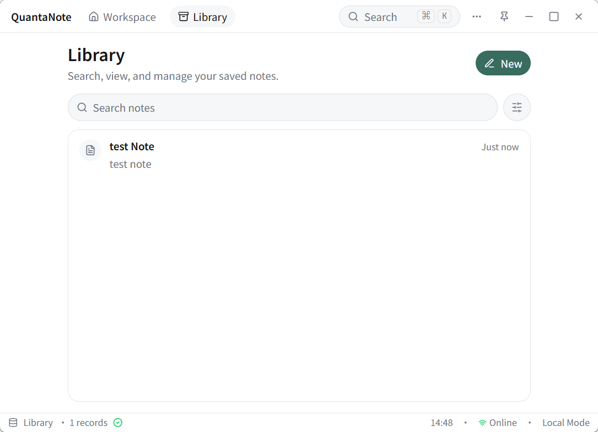
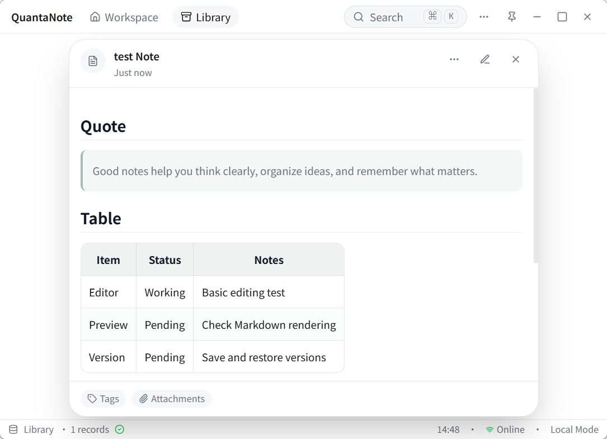
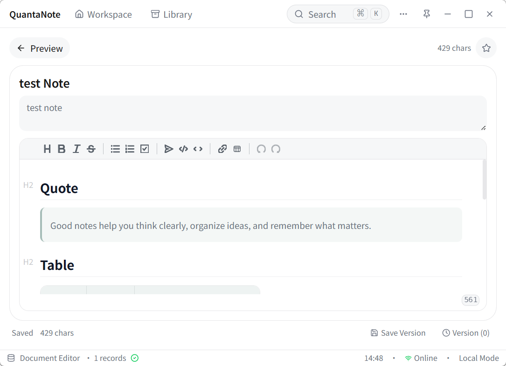
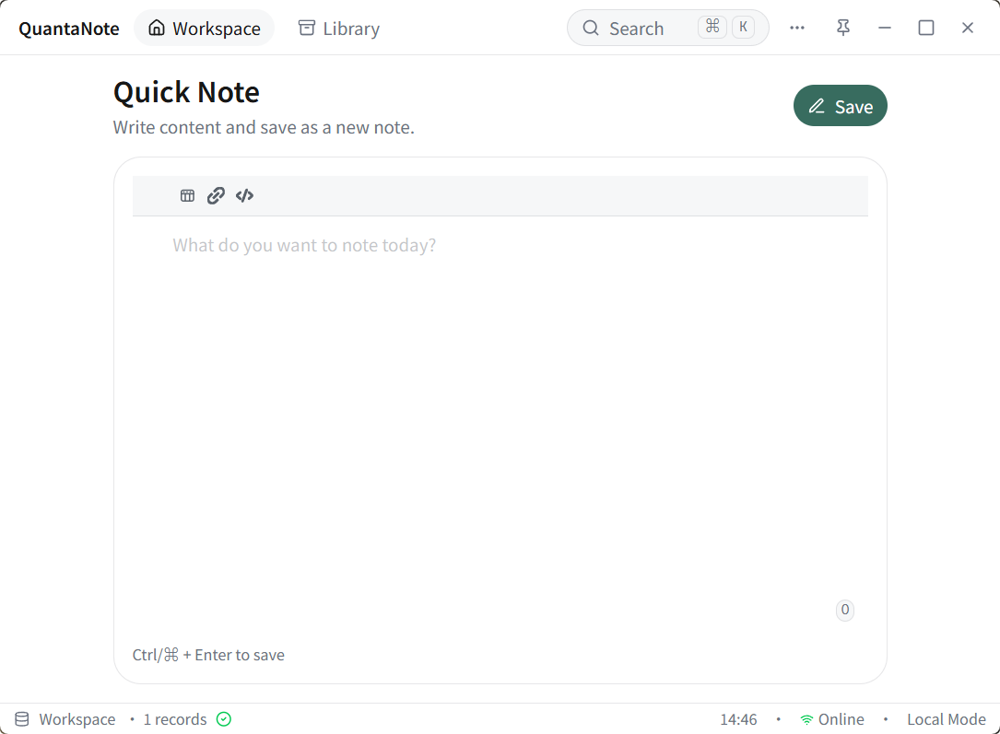
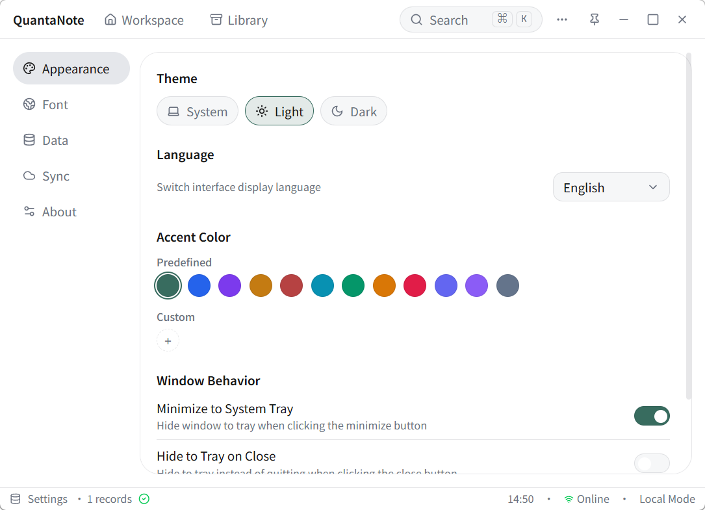
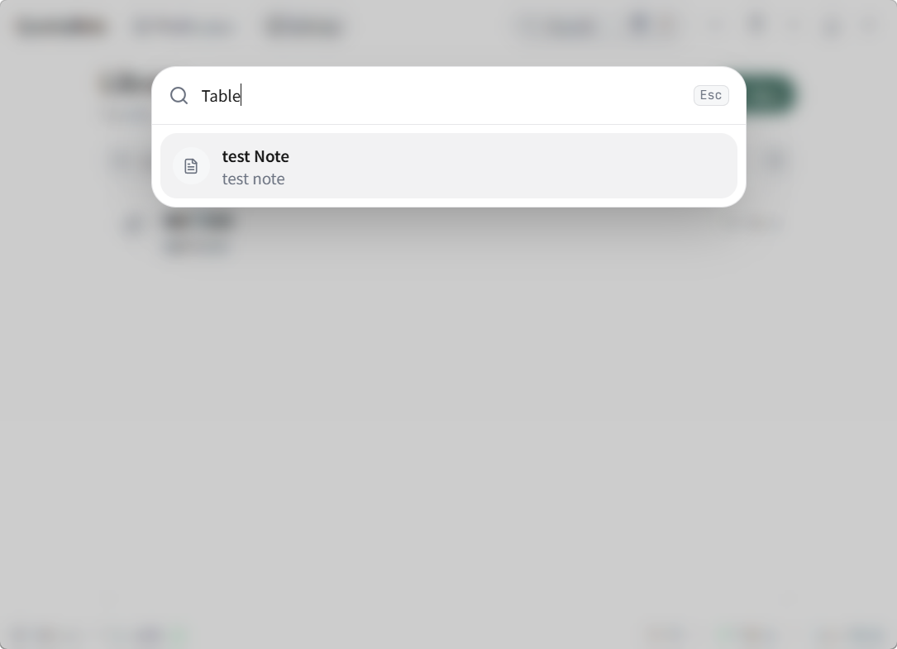
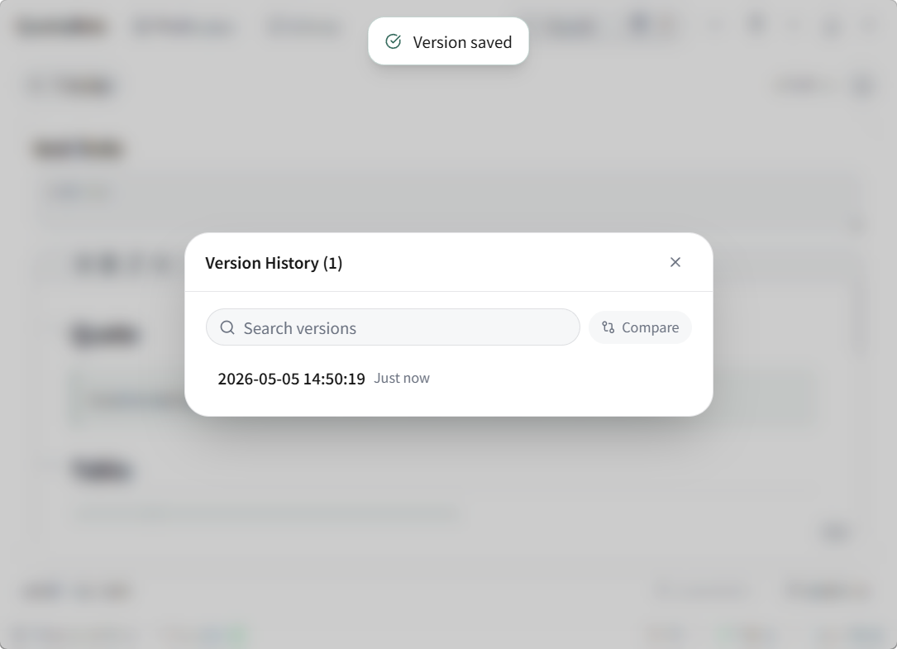

<div align="center">

# QuantaNote

**🌐 语言**: [English](./README.md) | [中文](#)


本地优先的桌面信息管理工具，支持 Markdown 笔记、全文搜索、标签管理、附件、版本历史和自动备份。数据全部本地存储。

**[功能](#-功能)** • **[截图](#-截图)** • **[快速开始](#-快速开始)** • **[技术栈](#-技术栈)** • **[下载](#-下载)**



</div>

## 功能

- **Markdown 编辑器** — Vditor IR 模式，快捷键工具栏，全文查找替换（`Ctrl+F` / `Ctrl+H`）
- **全文搜索** — FTS5 + trigram 双引擎，支持中文子串检索
- **标签管理** — 创建、编辑、筛选；多对多标签关联
- **命令面板** — `Ctrl+K` 全局快速搜索
- **版本历史** — 创建、预览、恢复版本；两个版本 Diff 对比
- **附件管理** — 支持图片/音频/视频/PDF/文本预览
- **导入导出** — JSON（含附件）或 ZIP（可选标签、附件、版本历史）
- **自动备份** — 定时备份，可配置间隔和保留数量
- **主题** — 深色/浅色/跟随系统，自定义强调色和字体
- **系统集成** — 最小化/关闭到托盘，右键菜单，开机自启动

## 截图

<div align="center">
<table>
  <tr>
    <td align="center"><br /><b>笔记预览</b></td>
    <td align="center"><br /><b>笔记编辑</b></td>
  </tr>
  <tr>
    <td align="center"><br /><b>快速记录</b></td>
    <td align="center"><br /><b>设置</b></td>
  </tr>
  <tr>
    <td align="center"><br /><b>命令面板</b></td>
    <td align="center"><br /><b>版本历史</b></td>
  </tr>
</table>

**[查看全部截图 →](./SCREENSHOTS.md)**
</div>

## 技术栈

| 层级 | 技术 |
|------|------|
| 前端 | React 19, TypeScript, Zustand 5, TailwindCSS 4, Vditor 3 |
| 后端 | Tauri 2, Rust, rusqlite 0.31 |
| 数据库 | SQLite（WAL 模式，FTS5 全文搜索） |
| 测试 | Vitest, Playwright, cargo test |

## 快速开始

```bash
# 安装依赖
pnpm install

# 开发模式（前端 + Rust 后端）
pnpm tauri dev

# 仅前端开发（Vite，端口 1420）
pnpm dev
```

## 构建

```bash
# 构建生产包（Windows: .msi + .exe, Linux: .deb + .AppImage, macOS: .dmg + .app）
pnpm tauri build

# 类型检查
pnpm build && cargo check --manifest-path src-tauri/Cargo.toml
```

## 下载

从 [GitHub Releases](https://github.com/shenjianZ/QuantaNote/releases) 下载对应平台的安装包。

## 许可证

[MIT](./LICENSE)
