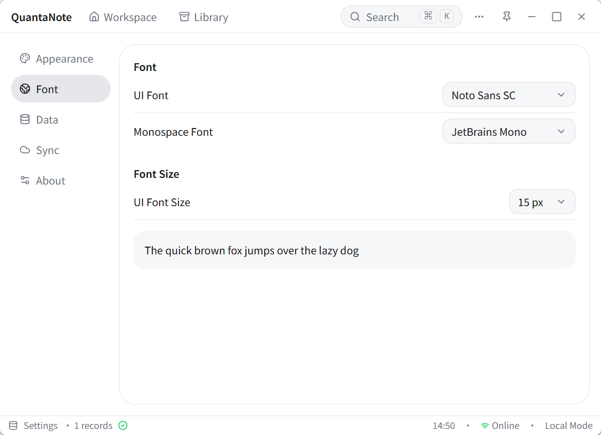
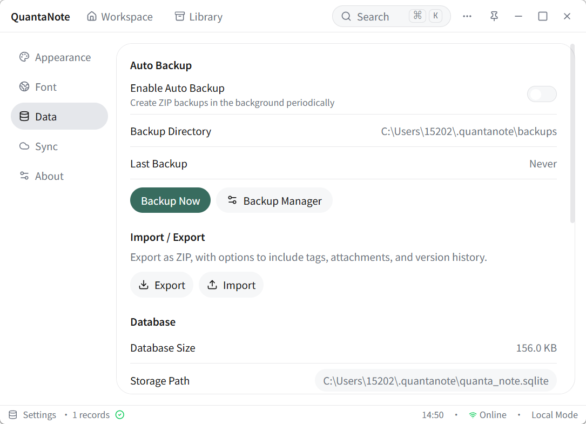
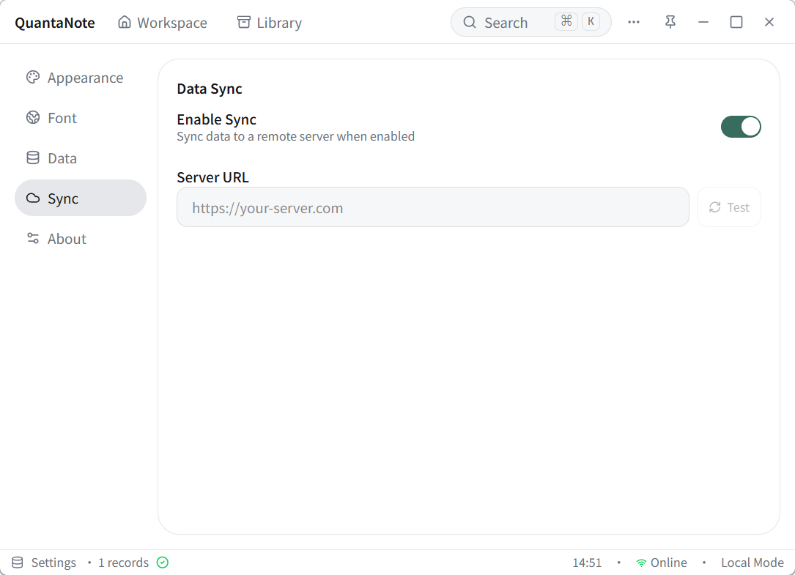
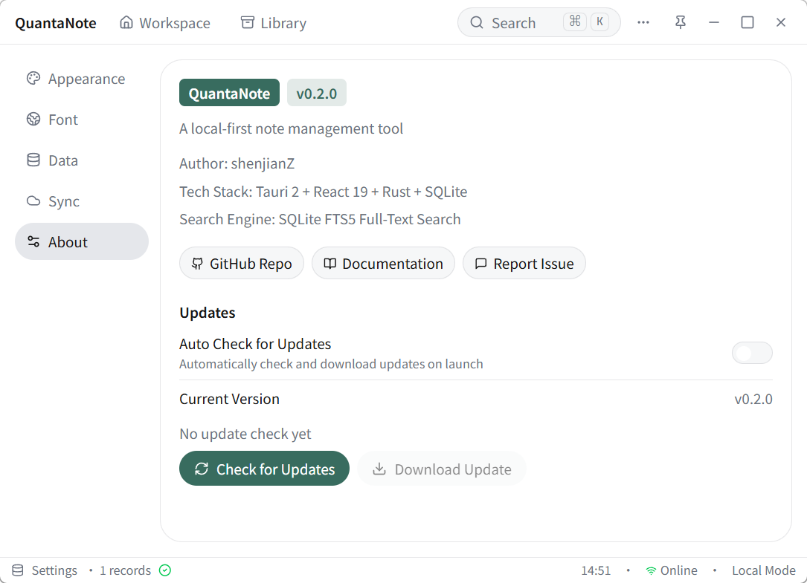
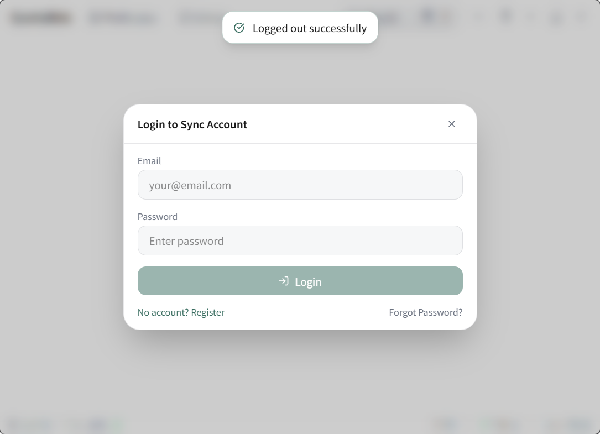
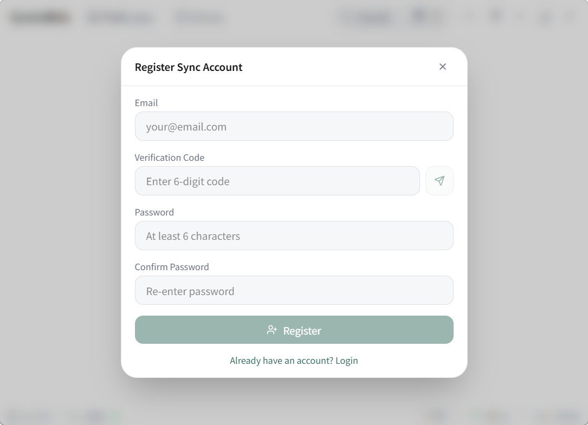
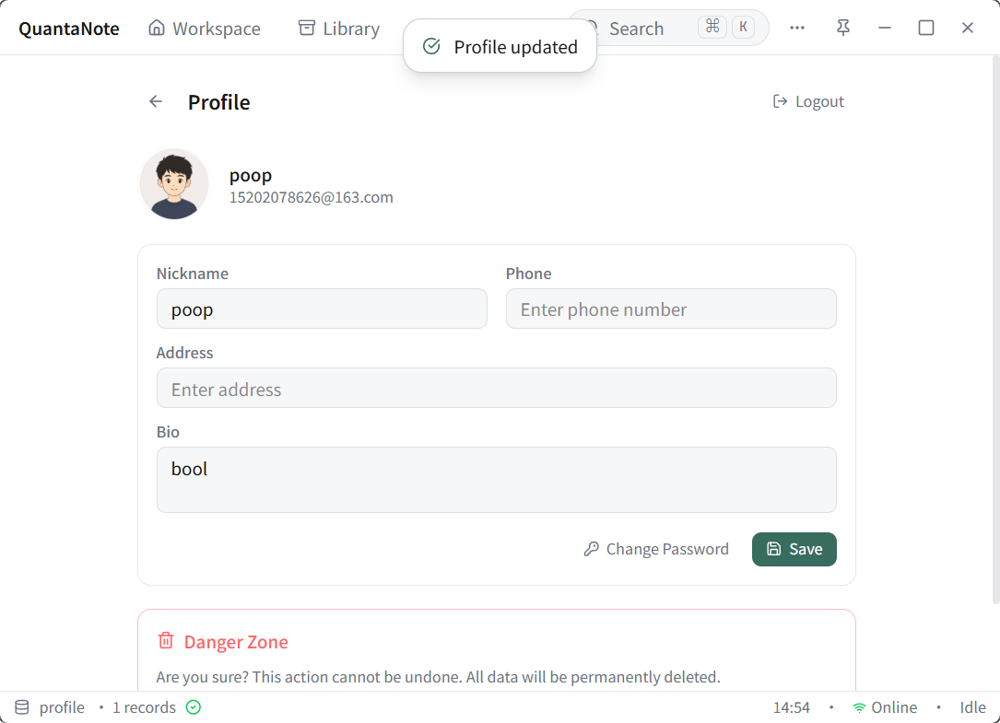
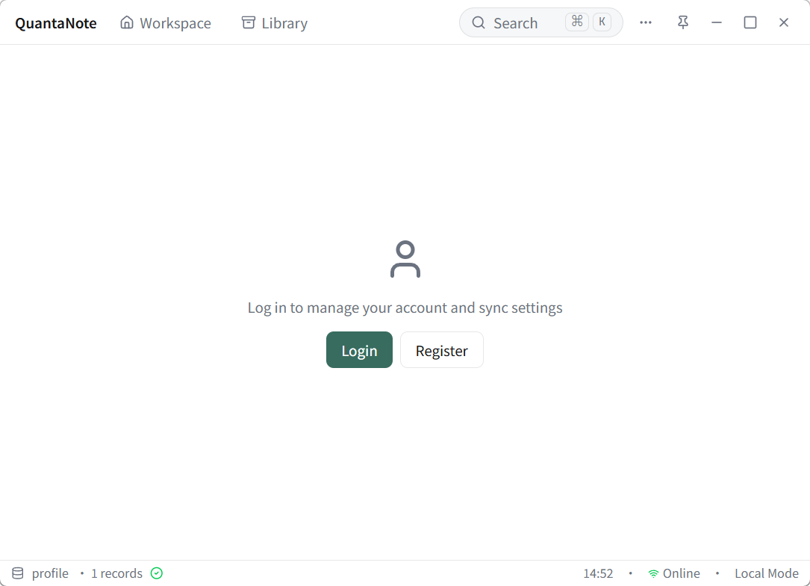
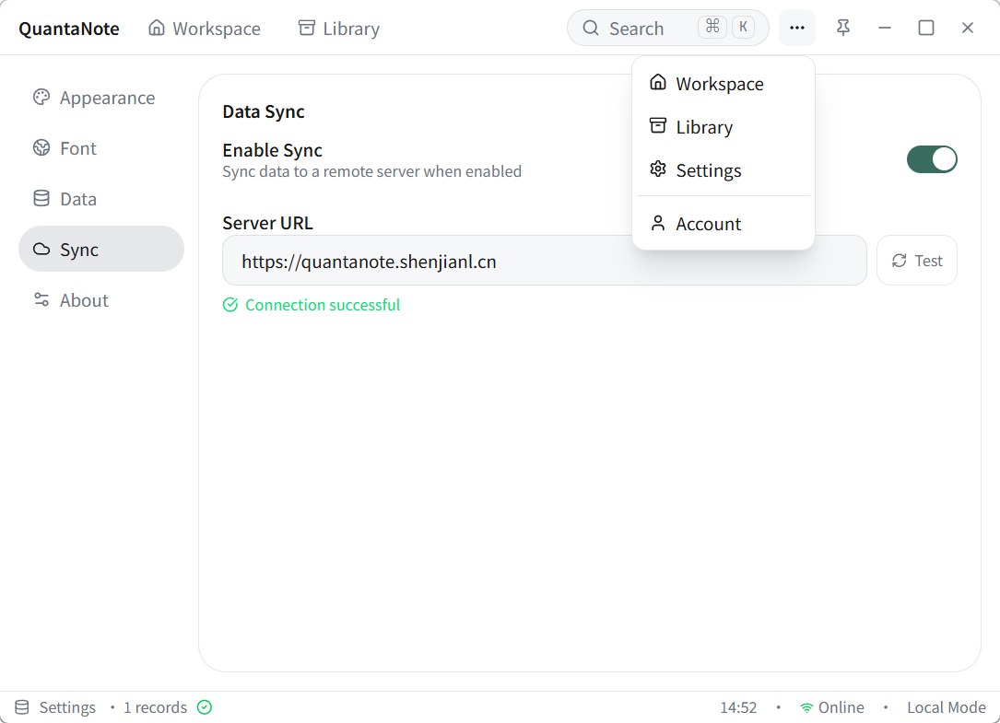

# QuantaNote Screenshots

[English](#english) | [中文](#中文)

---

## English

### Library

### Note Preview

### Note Editing

### Version History

### Workspace (Quick Capture)

### Command Palette (Ctrl+K)

### Settings — Appearance

### Settings — Font

### Settings — Data

### Settings — Sync

### Settings — About

### Account — Login

### Account — Register

### Account — Profile

### Account

### Top Bar — More Menu

---

## 中文

### 记录库

### 笔记预览

### 笔记编辑

### 版本历史

### 快速记录

### 命令面板 (Ctrl+K)

### 设置 — 外观

### 设置 — 字体

### 设置 — 数据

### 设置 — 同步

### 设置 — 关于

### 账户 — 登录

### 账户 — 注册

### 账户 — 个人资料

### 账户

### 顶栏 — 更多菜单

