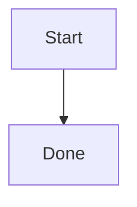

# Document Editor

The Document Editor provides a focused, full-screen editing experience. Open an item from the Library to edit it in the full editor.

The editor uses Vditor's IR (Instant Rendering) mode, keeping Markdown editable while showing the formatted result as you type.

## Title and Summary

The top of the editor contains item metadata:

- **Title**: Click the title to edit it; changes are synchronized with the Library.
- **Summary**: Enter a short description for Library cards and search result previews.
- **Fixed size**: The summary field keeps a fixed size. Put long content in the document body instead of expanding the summary.

Title and summary changes are included in auto-save. The application shows a status toast when saving succeeds or fails.

## Toolbar

The toolbar provides headings, bold, italic, strikethrough, lists, quotes, code, links, and tables. Clicking a button inserts the syntax at the current caret position.

### Insert a Table

1. Place the caret where the table should be inserted.
2. Click the table toolbar button.
3. Choose the row and column counts in the table panel.
4. Confirm to insert the table at the original caret position.

Opening the table panel preserves the editor selection. Clicking the panel does not lose the insertion location.

### Adjust an Existing Table

Place the caret inside an existing table and the table button changes its tooltip to **Adjust table**. The panel can:

- add or remove rows;
- add or remove columns;
- set the active column to left, center, or right alignment.

Reducing the row or column count removes cells from the end, so check the content before confirming. Existing cell content and alignment settings are preserved whenever possible.

Markdown table alignment uses these separator forms:

| Syntax | Result |
|--------|--------|
| `---` | Left aligned |
| `:---:` | Center aligned |
| `---:` | Right aligned |

## Live Rendering

The editor supports common Markdown, GFM, math, and chart syntax. Use the correct language markers for chart blocks:

````markdown


```flowchart
st=>start: Start
e=>end: Done
st->e
```
````

Supported content includes:

- headings, lists, task lists, blockquotes, and horizontal rules;
- bold, italic, strikethrough, inline code, and fenced code blocks;
- links, images, attachments, and HTML;
- GFM tables, footnotes, and definition lists;
- KaTeX inline and block formulas;
- Mermaid and Flowchart diagrams.

Scrolling does not recreate the entire preview. After scrolling stops, charts should remain stable without flicker or repeated initialization.

## Search and Replace

- `Ctrl + F`: open search for the current document.
- `Ctrl + H`: open search and replace.
- Use the arrow buttons to move between matches.
- Replace one match at a time or replace all matches.
- Press `Esc` to close the search bar.

## Copy and Paste

Select text and press `Ctrl + C` or use the copy action. A successful copy displays a toast. Pasting with `Ctrl + V` also displays a toast; failures are reported instead of being silent.

The packaged Windows desktop application writes to the native system clipboard first. When Windows Clipboard History is enabled, copied text can be viewed with `Win + V`. macOS and Linux do not provide the same Windows panel, so QuantaNote uses the clipboard APIs available on those platforms.

## Auto-Save

The editor uses debounced saving:

- continuous typing is grouped instead of saved on every keystroke;
- content is saved automatically after changes settle;
- failed saves preserve the edited content and show an error toast;
- leaving the editor performs a final save check when possible.

## Version Panel

Use the Version Panel to review, compare, and restore previous versions:

1. Open the Version Panel on the right side of the editor.
2. Browse versions in reverse chronological order.
3. Select two versions for a diff comparison.
4. Select a historical version and confirm the restore.

Restoring creates a new snapshot, so the previous state remains recoverable. See [Version History](./version-history) for details.

## Outline and Reading Width

The document outline lets you jump between headings while reading or previewing a document. The content-width control in Settings provides comfortable, wide, and custom widths for normal notes and wide tables.

## Leaving the Editor

Click the back button to return to the Library. The editor performs a save check before leaving; if saving fails, resolve the error before deleting any local data directory.
