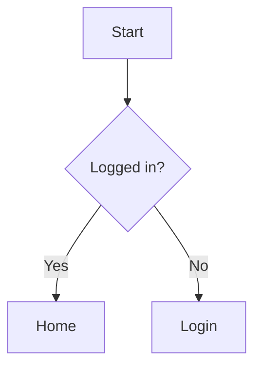

# Markdown Editor

QuantaNote uses Vditor's IR (Instant Rendering) mode. Markdown is rendered as you type while the source remains editable.

## Frontmatter and Note Properties

The Document Editor sidebar lets you maintain a note status, priority, due date, and aliases. These properties are written to Frontmatter at the top of the Markdown body, so they travel with export, backup, sync, and version history without creating a second source of truth.

```markdown
---
status: done
priority: high
due: 2026-09-12
aliases:
  - Search
  - Recherche
---
# Note body
```

Statuses include Inbox, In progress, Done, and Archived; priorities include Low, Medium, and High. The Reader Drawer hides the raw Frontmatter block and shows readable property badges above the body. The Library filter panel can filter by status and priority, and sort by priority or due date.

## Toolbar

| Button | Function | Description |
|--------|----------|-------------|
| H1-H6 | Headings | Insert level-one through level-six headings |
| **B** | Bold | Insert `**text**` |
| *I* | Italic | Insert `*text*` |
| ~~S~~ | Strikethrough | Insert `~~text~~` |
| Lists | Lists | Insert ordered or unordered lists |
| Task | Task list | Insert `- [ ]` |
| Indent | Indentation | Increase or decrease list indentation |
| Quote | Blockquote | Insert `> text` |
| Code | Code block | Insert a fenced code block with a language marker |
| `Code` | Inline code | Insert backtick code |
| Link | Hyperlink | Insert `[text](URL)` |
| Line | Horizontal rule | Insert a Markdown horizontal rule |
| Image | Image attachment | Choose a local image and insert a stable `attachment://...` reference |
| Attachment | Attachment link | Choose one or more files, insert links, or open the Attachment Manager |
| Table | Insert or adjust table | Shows “Insert table” or “Adjust table” based on the caret |

The table panel saves the caret position from before it opens, so clicking table settings does not insert the table at the wrong location.

## Tables and Alignment

After inserting a table, place the caret inside it to adjust the row count, column count, and active column alignment.

```markdown
| Left | Center | Right |
|:-----|:------:|------:|
| Text | Text   | 12345 |
```

Alignment markers are:

| Separator | Alignment |
|-----------|-----------|
| `:---` | Left |
| `:---:` | Center |
| `---:` | Right |

Reducing the table size removes rows or columns from the end. Check the trailing content before confirming.

## Supported Markdown Syntax

### Basic Markdown

```markdown
# Heading
**bold**, *italic*, ~~strikethrough~~, `inline code`

- Unordered list
1. Ordered list
- [ ] Task item

> Blockquote
---
[Link](https://example.com)

```

The image button creates the attachment automatically. You can also drop an image into the editor or paste a screenshot from the clipboard. The Attachment Manager's insert action can place an existing attachment at the current caret.

### AI Summary

The editor sidebar provides an “AI Summary” button. Before using it, enable the feature under “Settings → Data → AI Summary” and enter an OpenAI-compatible Chat Completions endpoint and model. The API key is stored separately in the system credential manager rather than the configuration file. A local compatible service may be used without an API key.

AI generation runs only after the user explicitly clicks the button. The request contains only the current note title and body; QuantaNote does not upload automatically and does not read or upload attachments, PDF text, or image OCR content. The result is written back as a manual summary. If the endpoint is unavailable or the configuration is incomplete, the existing body and summary are not overwritten.

### AI Tag Suggestions

The editor sidebar also provides a “Get AI tag suggestions” button, which calls the AI only after an explicit user click. Suggestions appear in a selectable preview list with new suggestions selected by default. Existing tags are not replaced; only after unchecking unwanted entries and clicking “Apply selected tags” are the chosen tags appended to the note. The request contains only the title and body, not attachments, PDF text, or image OCR content.

### AI Q&A and Related Notes

The editor sidebar's “AI Q&A and Related Notes” entry does not send requests automatically. After the user submits a question, the AI service receives only the current note's title, body, and that question; attachments, PDF text, and image OCR content are not read or uploaded. AI must be enabled in Settings, and each question requires an explicit submit action.

“Find related notes” uses local search only. It searches note titles, summaries, and bodies without uploading candidate notes to the AI service; the current note is excluded and duplicate results are removed before display. This local search also runs only after the user clicks the button.

### Note Links

Use `[[Note title]]` in the body to create a note link, or `[[Note title|Display label]]` to customize the visible text. Links can be clicked in the Library reader to navigate; clicking an unresolved target creates an empty note with that title. Examples inside fenced or inline code do not create relationships.

### GFM Extensions

Supported extensions include tables, task lists, strikethrough, footnotes, and definition lists.

Footnote example:

```markdown
Text with a footnote[^1].

[^1]: Footnote text.
```

Definition list example:

```markdown
Markdown
: A lightweight markup language

QuantaNote
: A note application that supports Markdown
```

### Code Blocks

Wrap code in three backticks and provide a language name for syntax highlighting:

````markdown
```javascript
function hello() {
  console.log("Hello, QuantaNote!");
}
```
````

### Math Formulas

Use a single `$` for inline formulas and `$$` for block formulas:

```markdown
Inline formula: $E = mc^2$

$$
e^{i\pi} + 1 = 0
$$
```

### Mermaid and Flowchart

Mermaid uses the `mermaid` marker:

````markdown

````

Flowchart uses the `flowchart` marker:

````markdown
```flowchart
st=>start: Start
op=>operation: Process data
e=>end: Done
st->op->e
```
````

Do not use `flow` as the marker for Flowchart syntax, or it will be displayed as a plain code block.

### HTML

Safe HTML is supported after sanitization:

```html
<div align="center">Centered HTML content</div>
```

Scripts, event attributes, and unsafe tags are filtered.

## Search and Replace

| Action | Shortcut | Description |
|--------|----------|-------------|
| Open search | `Ctrl + F` | Find text in the current document |
| Open replace | `Ctrl + H` | Show the replacement field |
| Next match | `Enter` | Jump to the next result |
| Previous match | `Shift + Enter` | Jump to the previous result |
| Close | `Esc` | Close the search bar |

Search and replacement use the text actually rendered by the editor, so link URLs, image references, and Markdown markers are not counted as visible text. Case-sensitive search, single replacement, and replace-all are supported.

## Copy, Paste, and Feedback

Select content and press `Ctrl + C` to copy or `Ctrl + V` to paste. Both success and failure are reported with a toast.

The packaged Windows application uses the native clipboard first, so copied content can be checked with `Win + V` when Clipboard History is enabled. macOS and Linux use their available clipboard APIs and do not provide the Windows-specific history panel.

## Shortcuts

| Shortcut | Action |
|----------|--------|
| `Ctrl + B` | Bold |
| `Ctrl + I` | Italic |
| `Ctrl + D` | Strikethrough |
| `Ctrl + F` | Search |
| `Ctrl + H` | Search and replace |
| `Ctrl + Z` | Undo |
| `Ctrl + Shift + Z` | Redo |
| `Ctrl + K` | Command Palette outside the editor |
| `Tab` | Indent a list |
| `Shift + Tab` | Outdent a list |

On macOS, the system convention usually uses `Command` instead of `Ctrl`. Linux and Windows use `Ctrl`.

The editor saves automatically and also supports `Ctrl + S` for an immediate save of the title, summary, and body. When leaving the editor, QuantaNote waits for the final save; if saving fails, it keeps the editor open and shows the error.
