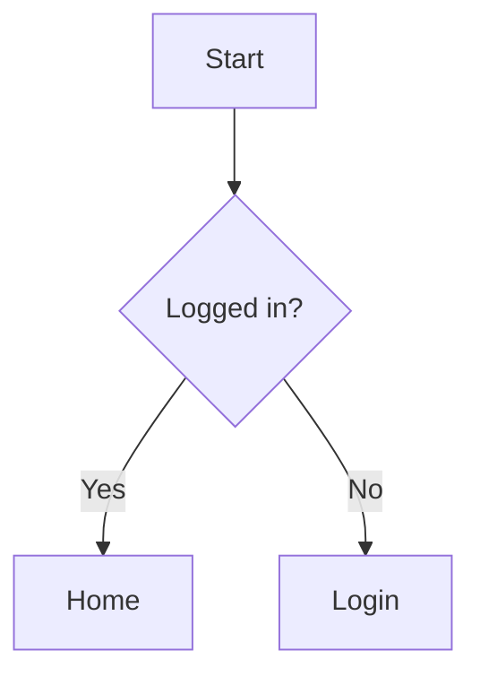

# Markdown Editor

QuantaNote uses Vditor's IR (Instant Rendering) mode. Markdown is rendered as you type while the source remains editable.

## Toolbar

| Button | Function | Description |
|--------|----------|-------------|
| H1-H6 | Headings | Insert level-one through level-six headings |
| **B** | Bold | Insert `**text**` |
| *I* | Italic | Insert `*text*` |
| ~~S~~ | Strikethrough | Insert `~~text~~` |
| Lists | Lists | Insert ordered or unordered lists |
| Task | Task list | Insert `- [ ]` |
| Indent | Indentation | Increase or decrease list indentation |
| Quote | Blockquote | Insert `> text` |
| Code | Code block | Insert a fenced code block with a language marker |
| `Code` | Inline code | Insert backtick code |
| Link | Hyperlink | Insert `[text](URL)` |
| Line | Horizontal rule | Insert a Markdown horizontal rule |
| Image | Image attachment | Choose a local image and insert a stable `attachment://...` reference |
| Attachment | Attachment link | Choose one or more files, insert links, or open the Attachment Manager |
| Table | Insert or adjust table | Shows “Insert table” or “Adjust table” based on the caret |

The table panel saves the caret position from before it opens, so clicking table settings does not insert the table at the wrong location.

## Tables and Alignment

After inserting a table, place the caret inside it to adjust the row count, column count, and active column alignment.

```markdown
| Left | Center | Right |
|:-----|:------:|------:|
| Text | Text   | 12345 |
```

Alignment markers are:

| Separator | Alignment |
|-----------|-----------|
| `:---` | Left |
| `:---:` | Center |
| `---:` | Right |

Reducing the table size removes rows or columns from the end. Check the trailing content before confirming.

## Supported Markdown Syntax

### Basic Markdown

```markdown
# Heading
**bold**, *italic*, ~~strikethrough~~, `inline code`

- Unordered list
1. Ordered list
- [ ] Task item

> Blockquote
---
[Link](https://example.com)

```

The image button creates the attachment automatically. You can also drop an image into the editor or paste a screenshot from the clipboard. The Attachment Manager's insert action can place an existing attachment at the current caret.

### GFM Extensions

Supported extensions include tables, task lists, strikethrough, footnotes, and definition lists.

Footnote example:

```markdown
Text with a footnote[^1].

[^1]: Footnote text.
```

Definition list example:

```markdown
Markdown
: A lightweight markup language

QuantaNote
: A note application that supports Markdown
```

### Code Blocks

Wrap code in three backticks and provide a language name for syntax highlighting:

````markdown
```javascript
function hello() {
  console.log("Hello, QuantaNote!");
}
```
````

### Math Formulas

Use a single `$` for inline formulas and `$$` for block formulas:

```markdown
Inline formula: $E = mc^2$

$$
e^{i\pi} + 1 = 0
$$
```

### Mermaid and Flowchart

Mermaid uses the `mermaid` marker:

````markdown

````

Flowchart uses the `flowchart` marker:

````markdown
```flowchart
st=>start: Start
op=>operation: Process data
e=>end: Done
st->op->e
```
````

Do not use `flow` as the marker for Flowchart syntax, or it will be displayed as a plain code block.

### HTML

Safe HTML is supported after sanitization:

```html
<div align="center">Centered HTML content</div>
```

Scripts, event attributes, and unsafe tags are filtered.

## Search and Replace

| Action | Shortcut | Description |
|--------|----------|-------------|
| Open search | `Ctrl + F` | Find text in the current document |
| Open replace | `Ctrl + H` | Show the replacement field |
| Next match | `Enter` | Jump to the next result |
| Previous match | `Shift + Enter` | Jump to the previous result |
| Close | `Esc` | Close the search bar |

Search and replacement use the text actually rendered by the editor, so link URLs, image references, and Markdown markers are not counted as visible text. Case-sensitive search, single replacement, and replace-all are supported.

## Copy, Paste, and Feedback

Select content and press `Ctrl + C` to copy or `Ctrl + V` to paste. Both success and failure are reported with a toast.

The packaged Windows application uses the native clipboard first, so copied content can be checked with `Win + V` when Clipboard History is enabled. macOS and Linux use their available clipboard APIs and do not provide the Windows-specific history panel.

## Shortcuts

| Shortcut | Action |
|----------|--------|
| `Ctrl + B` | Bold |
| `Ctrl + I` | Italic |
| `Ctrl + D` | Strikethrough |
| `Ctrl + F` | Search |
| `Ctrl + H` | Search and replace |
| `Ctrl + Z` | Undo |
| `Ctrl + Shift + Z` | Redo |
| `Ctrl + K` | Command Palette outside the editor |
| `Tab` | Indent a list |
| `Shift + Tab` | Outdent a list |

On macOS, the system convention usually uses `Command` instead of `Ctrl`. Linux and Windows use `Ctrl`.

The editor saves automatically, so `Ctrl + S` is not required. When leaving the editor, QuantaNote waits for the final save; if saving fails, it keeps the editor open and shows the error.
