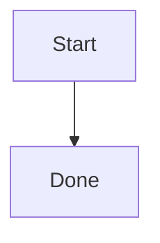

# Troubleshooting

This page covers common rendering, clipboard, installation, and update issues. First check whether you are using the packaged desktop application or a browser development preview, because they do not expose the same system capabilities.

## Charts Are Not Rendered

### Mermaid

Mermaid code blocks must use the `mermaid` language marker:

````markdown

````

### Flowchart

Flowchart syntax must use the `flowchart` language marker, not the `flow` marker used by some editors:

````markdown
```flowchart
st=>start: Start
e=>end: Done
st->e
```
````

If the block still appears as plain code, save the document and reopen the item. Packaged desktop builds include the chart runtime assets; if only a development preview fails, check that development dependencies are installed completely.

## Flicker After Scrolling

Charts and preview content should not be initialized again after scrolling stops. If you see visible flicker:

1. Confirm that you are running the latest version.
2. Close and reopen the item.
3. Check whether the document contains very large images or many charts.
4. Include the Markdown content and reproduction steps in an issue report.

The browser console message `Images loaded lazily and replaced with placeholders` is a browser lazy-loading intervention notice. It is not, by itself, a QuantaNote rendering failure. Continue troubleshooting only if an image remains blank or stuck as a placeholder.

## Windows Clipboard and Win + V

The packaged Windows desktop application uses the native Windows clipboard path first, so copied text can appear in Clipboard History when it is enabled and you press `Win + V`.

If the content does not appear in `Win + V`:

1. Confirm Clipboard History is enabled in Windows Settings.
2. Confirm that QuantaNote displayed a “Copy succeeded” toast.
3. Copy a short plain-text string and test again.
4. If other applications also fail to write to the clipboard, check the Windows Clipboard service.

A browser development preview may not have a native window handle and may use the Web Clipboard API instead. Browser permissions, the security context, or system policy can make that API unavailable.

## Clipboard on macOS and Linux

macOS and Linux do not have a universal system panel equivalent to Windows `Win + V`. QuantaNote still uses the clipboard APIs available on the platform, but it does not promise a Clipboard History panel with the same behavior as Windows.

After copying or pasting:

- A successful operation displays a success toast.
- A failed operation displays an error toast instead of failing silently.
- Use the platform's native shortcut or another application to verify system clipboard availability.

## Tables Cannot Be Inserted or Adjusted

The table toolbar button changes its purpose based on the caret position:

- Outside an existing table: it shows “Insert table”.
- Inside an existing table: it shows “Adjust table”.

The table panel can change the row count, column count, and column alignment. The editor selection is saved while the panel is open, so clicking the panel does not lose the insertion location.

If an adjustment does not apply, place the caret inside the target table cell before opening the toolbar panel.

## Summary Field Size

The summary field has a fixed size and is intended for a short description. Put detailed content in the document body; the summary is used for quick previews in the Library and search results.

## macOS Cannot Open the App

Current macOS packages may not be notarized by Apple. If macOS reports that the developer cannot be verified:

1. Open **System Settings** → **Privacy & Security**.
2. Find the QuantaNote block notice.
3. Click **Open Anyway**.

You can also right-click the application in Finder and choose **Open**.

## Windows SmartScreen

Without a Windows code-signing certificate, SmartScreen may show a warning on first launch. Confirm that the installer came from the official QuantaNote Release, then choose **More info** → **Run anyway**.

## Linux AppImage Does Not Run

Add execute permission first:

```bash
chmod +x QuantaNote-v0.4.0-linux-x64.AppImage
./QuantaNote-v0.4.0-linux-x64.AppImage
```

If the distribution is missing WebKit or GTK runtime libraries, install the dependencies listed in the installation guide.

## Automatic Updates Fail

Automatic updates depend on `latest.json`, the platform package, and its signature being present in the GitHub Release. If signature verification fails:

1. Do not delete the current data directory.
2. Download the matching installer manually from GitHub Releases.
3. Confirm that the current and target versions come from the official repository.
4. Include the error and platform architecture in an issue report.

The updater never asks users for a signing password. Signing keys are stored only in the release CI Secrets.

## Development Preview vs. Packaged App

A browser development preview is intended for UI debugging and may not provide Tauri native window access, system clipboard integration, file access, or the updater. Use a packaged desktop build to verify:

- Windows `Win + V` Clipboard History
- Automatic updates
- System tray and floating ball behavior
- File paths and attachment access
