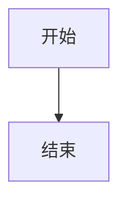

# 文档编辑器

文档编辑器提供全屏沉浸式的编辑体验。当你需要深入编辑一条记录时，从记录库打开记录即可进入编辑器。

编辑器基于 Vditor 的 IR（Instant Rendering，即时渲染）模式，在保留 Markdown 可编辑性的同时显示格式化结果。

## 标题和摘要

编辑器顶部提供记录元数据：

- **标题**：点击标题即可修改，修改后同步到记录库。
- **摘要**：输入简短描述，用于记录库卡片和搜索结果预览。
- **固定尺寸**：摘要输入框保持固定大小，长内容请放入正文，避免摘要影响页面布局。

标题和摘要的修改都会参与自动保存。保存成功或失败时，应用会显示对应状态提示。

### 摘要模式

- **自动摘要**：根据正文自动提取前 10 个字符。正文变化并保存后，摘要会同步更新。
- **手动摘要**：编辑摘要或切换到手动模式后，正文变化不会覆盖自定义摘要。
- **重新生成摘要**：点击“重新生成摘要”会根据当前正文生成新摘要，并切回自动模式。

摘要模式会随记录保存，关闭并重新进入编辑器后仍会保持。旧记录会根据已有摘要与正文的关系自动迁移：与正文前 10 个字符不同的非空摘要视为手动摘要。

## 工具栏

工具栏提供标题、加粗、斜体、删除线、列表、缩进、引用、代码、链接、分隔线、图片、附件和表格等操作。点击按钮时，语法会插入当前光标位置。

### 插入图片和附件

- 点击图片按钮，从系统文件选择器选择图片；图片会复制到当前记录的附件目录，并在光标位置插入图片。
- 点击附件按钮可以选择一个或多个文件并插入附件链接，也可以打开附件管理器。
- 将图片拖入编辑区，或直接把剪贴板中的截图粘贴到编辑区，会自动保存为当前记录的图片附件并插入。
- 文档保存的是稳定的 `attachment://...` 引用。附件移动或应用重新启动后，阅读器仍会根据附件 ID 解析图片，不需要手工维护本地路径。

如果只想管理文件而不插入链接，可以在编辑器顶部的附件按钮中打开附件管理器。

### 插入表格

1. 将光标放在希望插入表格的位置。
2. 点击表格工具栏按钮。
3. 在表格面板中设置行数和列数。
4. 点击确认，表格会插入到原来的光标位置。

打开表格面板不会丢失编辑器选区。即使鼠标点击了面板，插入位置仍然使用打开面板前保存的光标位置。

### 调整已有表格

将光标放入已有表格后，表格按钮的提示会变为 **调整表格**。点击后可以：

- 增加或减少行数；
- 增加或减少列数；
- 设置当前列为左对齐、居中或右对齐。

减少行列时会从末尾移除单元格；执行操作前请确认被移除的内容不再需要。已有单元格内容和当前列对齐设置会尽量保留。

Markdown 表格的对齐规则如下：

| 写法 | 效果 |
|------|------|
| `---` | 左对齐 |
| `:---:` | 居中对齐 |
| `---:` | 右对齐 |

## 即时渲染内容

编辑器支持常见 Markdown、GFM、数学公式和图表语法。图表代码块必须使用正确的语言标记：

````markdown


```flowchart
st=>start: 开始
e=>end: 结束
st->e
```
````

编辑器支持的内容包括：

- 标题、列表、任务列表、引用和分隔线；
- 加粗、斜体、删除线、行内代码和代码块；
- 链接、图片、附件和 HTML；
- GFM 表格、脚注和定义列表；
- KaTeX 行内公式和块级公式；
- Mermaid 和 Flowchart 图表。

鼠标滚动不会重新创建整个预览区域。正常情况下，滚动停止后图表不会闪烁或重新绘制。

## 搜索和替换

- `Ctrl + F`：打开当前文档搜索。
- `Ctrl + H`：打开搜索和替换。
- 使用上下按钮在匹配项之间跳转。
- 可以逐项替换，也可以一次替换全部匹配内容。
- 按 `Esc` 关闭搜索栏。

## 复制和粘贴

选择文本后使用 `Ctrl + C` 复制，使用 `Ctrl + V` 粘贴；编辑器内的复制由编辑器原生处理。将截图粘贴到编辑器会作为图片附件插入，普通文本粘贴后会显示粘贴提示。

Windows 正式桌面应用优先写入原生系统剪贴板，因此开启 Windows 剪贴板历史记录后，可以按 `Win + V` 查看复制内容。macOS 和 Linux 没有同等的 Windows 面板，应用会使用平台可用的剪贴板 API。

## 自动保存

编辑器使用防抖保存机制：

- 连续输入不会为每个按键单独保存；
- 内容停止变化后自动保存；
- 保存失败时保留编辑内容并显示错误提示；
- 返回记录库前会等待最后一次保存完成；保存失败时会停留在编辑器中，避免未保存内容被隐藏。
- 不需要使用 `Ctrl + S`，应用会自动保存。

## 版本面板

版本面板用于查看、比较和恢复历史版本：

1. 打开编辑器右侧的版本面板。
2. 查看按时间倒序排列的版本。
3. 选择两个版本进行 Diff 对比。
4. 选择历史版本并确认恢复。

恢复操作会产生新的版本快照，因此可以继续回退。详细说明请查看[版本历史](./version-history)。

## 文档大纲和阅读宽度

预览或阅读文档时，可以打开文档大纲，在标题之间快速跳转。设置中的内容宽度控制支持舒适、宽屏和自定义宽度，适合分别阅读普通笔记和宽表格。

## 返回和离开编辑器

编辑完成后点击返回按钮即可回到记录库。离开前编辑器会执行保存检查；如果保存失败，请先处理错误提示，不要直接删除本地数据目录。
