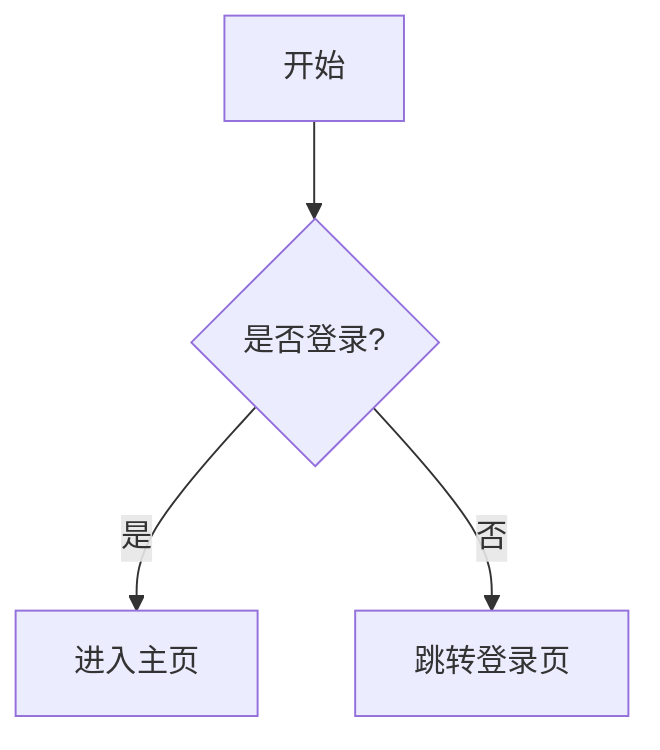

# Markdown 编辑器

QuantaNote 使用基于 Vditor 的 IR（Instant Rendering，即时渲染）模式。输入 Markdown 后，编辑区域会即时显示格式化结果，同时保留语法的可编辑性。

## 工具栏

| 按钮 | 功能 | 说明 |
|------|------|------|
| H1-H6 | 标题 | 插入一级到六级标题 |
| **B** | 加粗 | 插入 `**文本**` |
| *I* | 斜体 | 插入 `*文本*` |
| ~~S~~ | 删除线 | 插入 `~~文本~~` |
| 列表 | 列表 | 插入有序或无序列表 |
| 任务 | 任务列表 | 插入 `- [ ]` |
| 缩进 | 调整缩进 | 增加或减少列表缩进 |
| 引用 | 引用块 | 插入 `> 文本` |
| Code | 代码块 | 插入带语言标记的 fenced code block |
| `Code` | 行内代码 | 插入反引号代码 |
| 链接 | 超链接 | 插入 `[文本](URL)` |
| 分隔线 | 水平分隔线 | 插入 Markdown 分隔线 |
| 图片 | 图片附件 | 从本地选择图片并插入稳定的 `attachment://...` 引用 |
| 附件 | 附件链接 | 选择一个或多个文件并插入附件链接，或打开附件管理器 |
| 表格 | 插入或调整表格 | 根据光标位置显示“插入表格”或“调整表格” |

表格面板会保存打开前的光标位置，因此点击表格设置不会让表格插入到错误位置。

## 表格和对齐

插入表格后，将光标放进表格即可调整行数、列数和当前列对齐方式。

```markdown
| 左对齐 | 居中对齐 | 右对齐 |
|:-------|:--------:|-------:|
| 内容   | 内容     | 12345  |
```

对齐标记规则：

| 分隔线 | 对齐方式 |
|--------|----------|
| `:---` | 左对齐 |
| `:---:` | 居中对齐 |
| `---:` | 右对齐 |

缩减表格尺寸会从末尾移除行或列。确认前请检查末尾内容是否需要保留。

## 支持的 Markdown 语法

### 基础 Markdown

```markdown
# 一级标题
**粗体**、*斜体*、~~删除线~~、`行内代码`

- 无序列表
1. 有序列表
- [ ] 待办事项

> 引用
---
[链接](https://example.com)

```

图片按钮会自动创建附件。也可以把图片拖入编辑器，或将截图直接粘贴到编辑器；附件管理器中的插入按钮可将已有附件重新插入到当前光标位置。

### 笔记链接

在正文中使用 `[[笔记名称]]` 创建笔记链接，也可以使用 `[[笔记名称|显示名称]]` 自定义链接文字。链接在记录库阅读抽屉中可以点击跳转；目标不存在时，点击后会快速创建同名笔记。代码块和行内代码中的示例不会建立链接关系。

### GFM 扩展

- 表格
- 任务列表
- 删除线
- 脚注
- 定义列表

脚注示例：

```markdown
这是一段带脚注的文本[^1]。

[^1]: 脚注说明。
```

定义列表示例：

```markdown
Markdown
: 一种轻量级标记语言

QuantaNote
: 一个支持 Markdown 的笔记应用
```

### 代码块

使用三个反引号包裹代码，并指定语言名称以启用语法高亮：

````markdown
```javascript
function hello() {
  console.log("Hello, QuantaNote!");
}
```
````

### 数学公式

行内公式使用单个 `$`，块级公式使用 `$$`：

```markdown
行内公式：$E = mc^2$

$$
e^{i\pi} + 1 = 0
$$
```

### Mermaid 和 Flowchart

Mermaid 使用 `mermaid` 标记：

````markdown

````

Flowchart 使用 `flowchart` 标记：

````markdown
```flowchart
st=>start: 开始
op=>operation: 处理数据
e=>end: 结束
st->op->e
```
````

不要把 Flowchart 标记写成 `flow`，否则会按普通代码块显示。

### HTML

允许使用经过安全过滤的 HTML：

```html
<div align="center">这是居中的 HTML 内容</div>
```

脚本、事件属性和不安全标签会被过滤。

## 搜索和替换

| 操作 | 快捷键 | 说明 |
|------|--------|------|
| 打开搜索 | `Ctrl + F` | 查找当前文档中的文本 |
| 打开替换 | `Ctrl + H` | 显示替换输入框 |
| 下一个匹配 | `Enter` | 跳到下一个结果 |
| 上一个匹配 | `Shift + Enter` | 跳到上一个结果 |
| 关闭 | `Esc` | 关闭搜索栏 |

搜索和替换以编辑器实际显示的文本为准，不会把链接地址、图片引用或 Markdown 标记误算为可见文本。支持区分大小写、逐项替换和全部替换。

## 复制、粘贴和提示

选择内容后按 `Ctrl + C` 复制，按 `Ctrl + V` 粘贴。成功或失败都会显示 Toast 提示。

Windows 正式应用会优先调用原生剪贴板，因此开启系统剪贴板历史记录后可以使用 `Win + V` 查看。macOS/Linux 使用系统可用的 Clipboard API，不提供 Windows 专属的历史记录面板。

## 快捷键

| 快捷键 | 功能 |
|--------|------|
| `Ctrl + B` | 加粗 |
| `Ctrl + I` | 斜体 |
| `Ctrl + D` | 删除线 |
| `Ctrl + F` | 搜索 |
| `Ctrl + H` | 搜索替换 |
| `Ctrl + Z` | 撤销 |
| `Ctrl + Shift + Z` | 重做 |
| `Ctrl + K` | 命令面板（编辑器外） |
| `Tab` | 列表缩进 |
| `Shift + Tab` | 取消缩进 |

在 macOS 上，系统通常使用 `Command` 替代 `Ctrl`。Linux 和 Windows 使用 `Ctrl`。

编辑器会自动保存，也支持使用 `Ctrl + S` 立即保存标题、摘要和正文。离开编辑器时会等待最后一次保存；如果保存失败，会保留在当前页面并提示重试。
