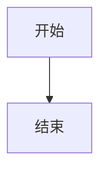

# 故障排查

本页汇总 QuantaNote 使用过程中最常见的渲染、剪贴板、安装和更新问题。先确认你使用的是正式桌面应用还是浏览器开发预览，因为两者可使用的系统能力不同。

## 图表没有渲染

### Mermaid

Mermaid 代码块必须使用 `mermaid` 语言标记：

````markdown

````

### Flowchart

Flowchart 语法必须使用 `flowchart` 语言标记，而不是某些编辑器使用的 `flow`：

````markdown
```flowchart
st=>start: 开始
e=>end: 结束
st->e
```
````

如果代码块仍然显示为普通代码，请先保存文档，再重新打开记录。正式安装包会打包图表运行时资源；如果只有开发预览失败，请检查开发依赖是否完整安装。

## 滚动时页面闪烁

鼠标滚动停止后，图表和预览内容不应重新初始化。如果看到明显闪烁：

1. 确认正在使用最新版本。
2. 关闭当前记录后重新打开。
3. 检查同一页面中是否存在超大的图片或大量图表。
4. 在问题反馈中附上 Markdown 内容和复现步骤。

浏览器控制台中出现 `Images loaded lazily and replaced with placeholders` 是浏览器的图片懒加载提示，不代表 QuantaNote 渲染失败。只有图片一直显示为空白或占位符时，才需要继续排查图片路径和附件权限。

## Windows 剪贴板和 Win + V

正式 Windows 桌面应用会优先使用 Windows 原生剪贴板写入方式，因此复制文本后可以在系统启用剪贴板历史记录时按 `Win + V` 查看。

如果 `Win + V` 中没有内容：

1. 确认剪贴板历史记录已在 Windows 设置中开启。
2. 确认复制动作显示了“复制成功”提示。
3. 重新复制一段纯文本进行测试。
4. 如果其他应用也无法写入剪贴板，请检查 Windows 剪贴板服务。

浏览器开发预览不一定拥有原生窗口句柄，因此可能只能使用 Web Clipboard API。浏览器权限、页面安全上下文或系统策略可能导致复制失败。

## macOS 和 Linux 剪贴板

macOS 和 Linux 没有 Windows `Win + V` 对应的统一系统面板。QuantaNote 仍会通过平台可用的系统或 Web Clipboard API 执行复制粘贴，但不会承诺提供 Windows Clipboard History 同等功能。

复制或粘贴后：

- 成功时会显示成功提示。
- 失败时会显示错误提示，不会静默丢失操作结果。
- 可以改用系统快捷键或其他应用验证系统剪贴板是否可用。

## 表格无法插入或调整

表格工具栏按钮会根据光标位置改变用途：

- 光标不在已有表格中：显示“插入表格”。
- 光标位于已有表格中：显示“调整表格”。

点击按钮打开表格面板后，可以设置行数、列数和列对齐方式。工具栏面板打开时会保存编辑器原来的选区，因此不会因为点击面板而丢失插入位置。

如果调整没有生效，请先把光标放入目标表格单元格，再打开工具栏面板。

## 摘要输入框大小

摘要字段使用固定尺寸，适合输入简短描述。内容较长时请将详细内容放入正文，摘要用于记录库卡片和搜索结果中的快速预览。

## macOS 无法打开应用

当前 macOS 安装包可能未经过 Apple 公证。首次启动时如果提示无法验证开发者：

1. 打开“系统设置”→“隐私与安全性”。
2. 找到 QuantaNote 的拦截提示。
3. 点击“仍要打开”。

也可以在 Finder 中右键点击应用并选择“打开”。

## Windows SmartScreen 提示

未购买或未配置 Windows 代码签名证书时，首次运行可能出现 SmartScreen 提示。确认安装包来自 QuantaNote 官方 Release 后，点击“更多信息”→“仍要运行”。

## Linux AppImage 无法运行

先添加执行权限：

```bash
chmod +x QuantaNote-v0.4.0-linux-x64.AppImage
./QuantaNote-v0.4.0-linux-x64.AppImage
```

如果系统缺少 WebKit 或 GTK 运行库，请按照发行版安装指南补齐依赖。

## 自动更新失败

自动更新依赖 GitHub Release 中的 `latest.json`、平台安装包和签名文件。遇到签名校验失败时：

1. 不要删除当前版本的数据目录。
2. 从 GitHub Release 手动下载对应平台安装包。
3. 确认当前版本和目标版本来自同一个官方仓库。
4. 将错误信息和平台架构提交到 Issues。

自动更新不会要求用户提供签名密码；签名私钥只保存在发布 CI Secrets 中。

## 开发模式和正式应用的差异

浏览器开发预览主要用于 UI 调试，不一定具备 Tauri 原生窗口、系统剪贴板、文件系统和更新器能力。验证以下功能时，必须使用打包后的正式桌面应用：

- Windows `Win + V` 剪贴板历史记录
- 自动更新
- 系统托盘和悬浮球
- 文件路径和附件访问
