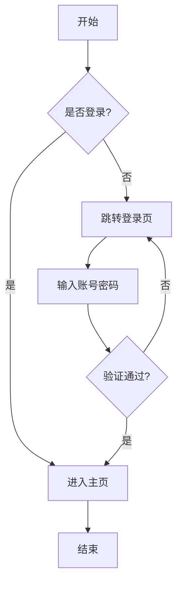
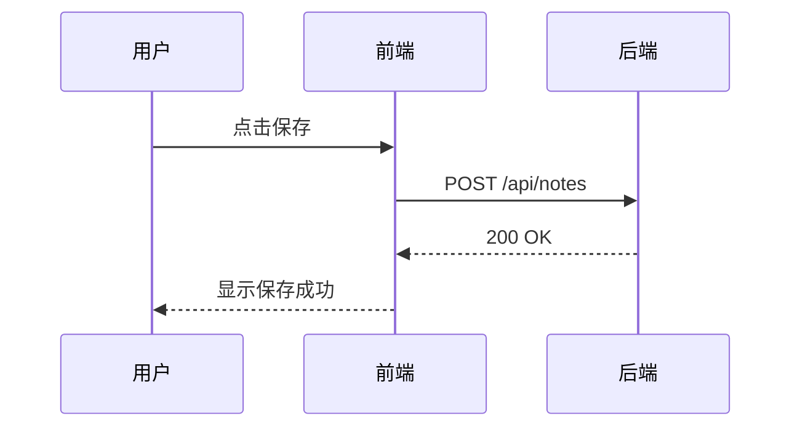

# Markdown 语法测试文档

本文档覆盖 Markdown 的全部常用语法，用于测试渲染效果。以下所有语法块均为实际内容，而非代码示例。

## 一、标题

# 一级标题 H1
## 二级标题 H2
### 三级标题 H3
#### 四级标题 H4
##### 五级标题 H5
###### 六级标题 H6

## 二、段落与文本强调

这是一个普通段落。Markdown 中的换行：
通过两个空格加回车可以实现段内软换行（下一行）。

这是另一个段落，段落之间用空行分隔。

**粗体文本**　*斜体文本*　***粗斜体文本***　~~删除线文本~~　`行内代码`

==高亮文本（Mark 语法）==

中文强调测试：**加粗中文**、*斜体中文*、~~删除中文~~。

下划线需要借助 HTML：<u>下划线文本</u>

## 三、引用

> 这是一级引用。
> 引用内可以包含多个段落（中间有空行）。
>
> 第二个段落。

> 一级引用
> > 二级嵌套引用
> > > 三级嵌套引用

> 引用中可以包含其他元素：
> - 列表项 1
> - 列表项 2
>
> ```js
> console.log("引用中的代码块");
> ```
>
> **还有粗体**和*斜体*。

## 四、列表

### 无序列表

- 第一项
- 第二项
  - 嵌套项 2.1
  - 嵌套项 2.2
    - 更深层的嵌套项
- 第三项

* 星号列表项
+ 加号列表项

### 有序列表

1. 第一项
2. 第二项
   1. 嵌套有序项 2.1
   2. 嵌套有序项 2.2
3. 第三项

### 任务列表

- [x] 已完成的任务
- [ ] 未完成的任务
- [ ] 另一个未完成任务
  - [x] 嵌套已完成的子任务
  - [ ] 嵌套未完成的子任务

## 五、代码块

### JavaScript

```javascript
// 冒泡排序
function bubbleSort(arr) {
  const len = arr.length;
  for (let i = 0; i < len - 1; i++) {
    for (let j = 0; j < len - 1 - i; j++) {
      if (arr[j] > arr[j + 1]) {
        [arr[j], arr[j + 1]] = [arr[j + 1], arr[j]];
      }
    }
  }
  return arr;
}
console.log(bubbleSort([5, 3, 8, 1, 9]));
```

### Python

```python
def fibonacci(n: int) -> list[int]:
    """生成斐波那契数列"""
    seq = [0, 1]
    while len(seq) < n:
        seq.append(seq[-1] + seq[-2])
    return seq[:n]

print(fibonacci(10))
```

### Rust

```rust
fn main() {
    let words = vec!["Hello", "QuantaNote"];
    let sentence: String = words.join(", ");
    println!("{}", sentence);

    let nums: Vec<i32> = (1..=10).filter(|n| n % 2 == 0).collect();
    println!("{:?}", nums);
}
```

### JSON

```json
{
  "name": "QuantaNote",
  "version": "1.0.0",
  "features": ["markdown", "preview", "outline"],
  "openSource": true
}
```

### Bash

```bash
#!/bin/bash
echo "当前目录: $(pwd)"
for file in *.md; do
  echo "找到文件: $file"
done
```

### SQL

```sql
SELECT id, title, created_at
FROM documents
WHERE status = 'published'
ORDER BY created_at DESC
LIMIT 10;
```

### 不带语言高亮的代码块

```
这是一段没有指定语言的代码块
   保留    缩进
和特殊字符 < > & " '
```

## 六、表格

| 左对齐列 | 居中对齐列 | 右对齐列 |
|:---------|:----------:|---------:|
| 单元格 | 单元格 | 单元格 |
| 较长的内容用于测试列宽自适应 | 中间 | 12345 |
| `行内代码` | **粗体** | ~~删除~~ |
| [链接](https://example.com) |  | 普通 |

包含较多行的表格：

| 语法 | 符号 | 说明 |
|------|------|------|
| 粗体 | `**text**` | 加粗显示 |
| 斜体 | `*text*` | 倾斜显示 |
| 删除线 | `~~text~~` | 删除线 |
| 行内代码 | `` `code` `` | 等宽字体 |
| 链接 | `[text](url)` | 超链接 |
| 图片 | `` | 嵌入图片 |

## 七、链接

行内链接：[QuantaNote 官网](https://example.com "悬停提示标题")

自动链接：<https://www.example.com>

邮箱自动链接：<contact@example.com>

引用式链接：[引用式链接][ref-link]

[ref-link]: https://example.com "引用式链接的标题"

锚点链接：[跳转到本文档顶部标题](#markdown-语法测试文档)

URL 直接出现在文本中：https://github.com （部分渲染器支持自动识别）

## 八、图片

行内图片语法：


带尺寸控制（HTML 写法）：


图片链接（点击图片跳转）：

[](https://example.com)

## 九、分隔线

三种分隔线写法：

---

***

* * *

## 十、脚注

这里有一个脚注引用[^1]，还有一个长脚注[^long-note]。

[^1]: 这是脚注的内容。

[^long-note]: 这是一个包含多段内容的脚注。
    后面缩进的行都会归入该脚注。
    可以包含 **粗体** 等 Markdown 语法。

## 十一、定义列表

Markdown
: 一种轻量级标记语言。

QuantaNote
: 一个支持 Markdown 的笔记应用。
: 第二条定义。

GFM
: GitHub Flavored Markdown
: 包含表格、任务列表、删除线等扩展语法。

## 十二、数学公式

行内公式：质能方程 $E = mc^2$，欧拉公式 $e^{i\pi} + 1 = 0$。

块级公式：

$$
\frac{\partial u}{\partial t} = \alpha^2 \nabla^2 u
$$

$$
\int_{-\infty}^{\infty} e^{-x^2} \, dx = \sqrt{\pi}
$$

$$
\sum_{n=1}^{\infty} \frac{1}{n^2} = \frac{\pi^2}{6}
$$

矩阵：

$$
\begin{bmatrix}
a & b \\
c & d
\end{bmatrix}
\begin{bmatrix}
x \\
y
\end{bmatrix}
=
\begin{bmatrix}
ax + by \\
cx + dy
\end{bmatrix}
$$

## 十三、流程图与时序图（Mermaid）





## 十四、流程图（Flowchart 语法）

注意：Vditor 要求语言标记为 `flowchart`（而非 Typora 风格的 `flow`），否则只会显示为普通代码块。

```flowchart
st=>start: 开始
op=>operation: 处理数据
cond=>condition: 成功?
e=>end: 结束
st->op->cond
cond(yes)->e
cond(no)->op
```

## 十五、内嵌 HTML

<div align="center">
  <p>这是居中对齐的 HTML 块（通过 div + align）</p>
</div>

<p style="color: #e67e22;">带内联样式的段落（部分渲染器出于安全会过滤 style）</p>

<table>
  <tr><th>HTML 表头 A</th><th>HTML 表头 B</th></tr>
  <tr><td>HTML 单元格 1</td><td>HTML 单元格 2</td></tr>
</table>

<kbd>Ctrl</kbd> + <kbd>S</kbd> 保存快捷键（kbd 标签）

<strong>HTML 粗体</strong>、<em>HTML 斜体</em>、<del>HTML 删除</del>、<mark>HTML 高亮</mark>

H<sub>2</sub>O（下标）　X<sup>2</sup>（上标）

<br/>

## 十六、转义字符

\* 星号不是斜体 \*
\# 井号不是标题
\`\` 反引号不是代码
\| 竖线不是表格
\\ 反斜杠本身
\_ 下划线 \_
\[方括号\] \(圆括号\)
\> 大于号不是引用
\~\~ 波浪线不是删除线

特殊字符直接输出：© ® ™ € £ ¥ ° ± × ÷ ≠ ≤ ≥ ¶ § † ‡ • … → ← ↔ ⇒

## 十七、Emoji 表情

直接输入：:smile: :heart: :thumbsup: :rocket: :star: :fire: :tada: :100:

Unicode 字符：😀 😂 🥰 😎 🤔 👍 ❤️ 🎉 🚀 ⭐ 🔥 ✅ ❌ ⚠️ 💡 📝 📌 🗂️ 📎 🔍

## 十八、上下标（部分渲染器扩展语法）

H~2~O（波浪线语法下标）　X^2^（尖号语法上标）

HTML 写法：a<sub>ij</sub> 与 2<sup>n</sup>

## 十九、超长行与长单词

这是一个非常长的段落，用于测试文本的自动换行与溢出处理能力。编辑器需要正确处理长段落的换行，而不是让文本水平溢出容器边界，同时在缩放窗口大小时保持良好的阅读体验，行宽与行高都应保持在合理范围内，避免出现过长的单行文本导致阅读困难的问题。

超长不间断字符串测试：SupercalifragilisticexpialidociousSupercalifragilisticexpialidociousSupercalifragilisticexpialidocious

超长 URL 测试：
https://www.example.com/a/very/long/path/that/goes/on/and/on/forever?query=1&another=2&more=3&even=more&parameters=here

## 二十、混合嵌套测试

> 嵌套组合一：引用内嵌列表与代码
> 1. 有序项
>    - 无序子项
>      ```python
>      print("三层嵌套中的代码块")
>      ```
> 2. 另一项

- 列表内嵌引用
  > 引用内容出现在列表项内部
  > 第二行引用
- 列表内嵌表格

  | A | B |
  |---|---|
  | 1 | 2 |

- 列表内嵌图片

  

1. 反向测试：有序列表内嵌代码块

   ```
   有序列表里的代码块
   ```

2. 结束项

**粗体内嵌 `行内代码` 与 [链接](https://example.com) 和 ~~删除线~~ 的组合。**

*斜体内嵌 **粗体** 与 `代码` 的组合。*

---

> 最后一行：文档结束。✅ 如果以上所有语法都能正常渲染，说明渲染器支持良好。
